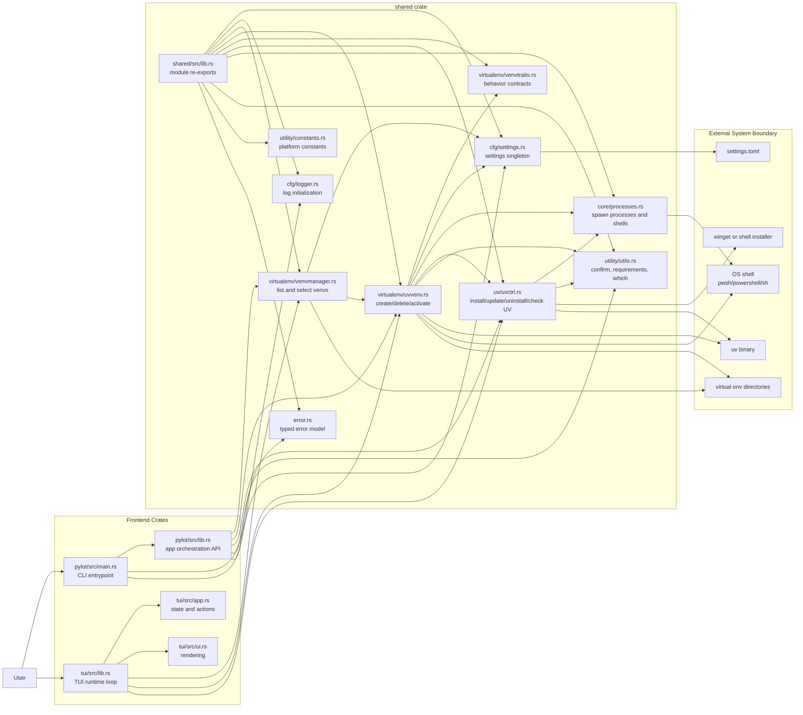
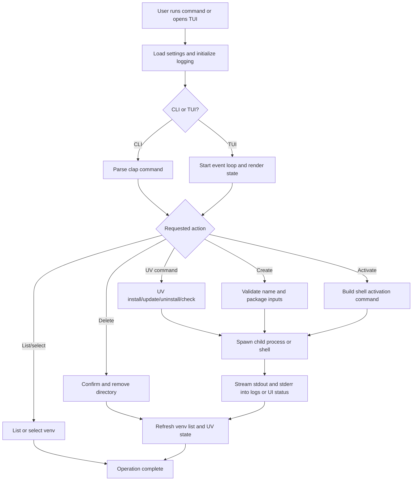

# Project Architecture Blueprint

Generated: 2026-03-20

## Overview

Pylot is a Rust workspace with three crates organized around a simple adapter-to-core split:

- `pylot`: command-line frontend and public application API.
- `pylot-tui`: terminal UI frontend.
- `shared`: reusable core and infrastructure services used by both frontends.

The implemented style is a layered modular monolith rather than separate services:

- Frontend adapters accept user input.
- Application orchestration delegates into shared modules.
- Shared modules perform configuration loading, process execution, UV management, and virtual environment lifecycle work.
- External dependencies are the local filesystem, shell processes, and platform package managers (`uv`, `winget`, `sh`, `pwsh`/`powershell`).

## Primary Architecture

## Runtime Interaction Flow

## Architectural Boundaries

- `pylot/src/main.rs` is the executable adapter. It parses commands, initializes settings/logging, and dispatches into the library API or TUI.
- `pylot/src/lib.rs` is the application orchestration layer for CLI operations. It validates inputs, enforces flow, and delegates execution to shared components.
- `shared/src/virtualenv/uvvenv.rs` contains the concrete virtual environment lifecycle behavior.
- `shared/src/virtualenv/venvmanager.rs` centralizes discovery, selection, and table rendering for environments.
- `shared/src/uv/uvctrl.rs` encapsulates UV installation, update, uninstall, and availability checks.
- `shared/src/core/processes.rs` is the process boundary for spawning subprocesses and activating child shells.
- `shared/src/cfg/settings.rs` provides a process-wide settings singleton and creates the configured venv directory if needed.
- `tui/src/lib.rs`, `tui/src/app.rs`, and `tui/src/ui.rs` implement a thin interactive adapter over the same shared operations.

## Key Design Patterns

- Shared core via crate reuse: both frontends call into the same `shared` crate rather than duplicating environment or UV logic.
- Thin adapters: CLI and TUI own presentation and input handling, while environment and tool management stay in shared modules.
- Trait-based behavior: `Create`, `Delete`, and `Activate` define the lifecycle operations implemented by `UvVenv`.
- Process boundary isolation: all command spawning and shell activation flow through `shared/src/core/processes.rs`.
- Global singletons where convenient: `Settings` and `VENVMANAGER` use `LazyLock`, which simplifies access but also makes dependency injection less explicit.

## Extension Guidance

- Add new end-user commands in `pylot/src/cli/cmds.rs` and dispatch them from `pylot/src/main.rs`.
- Keep orchestration in `pylot/src/lib.rs` small; move reusable behavior into `shared` when both frontends could need it.
- Add new venv lifecycle behavior behind `shared/src/virtualenv/venvtraits.rs` and implement it in `shared/src/virtualenv/uvvenv.rs` or another concrete type.
- Keep OS-specific process and package-manager logic inside `shared/src/core/processes.rs`, `shared/src/uv/uvctrl.rs`, and `shared/src/utility/constants.rs`.
- Prefer updating TUI state and UI rendering in `tui/src/app.rs` and `tui/src/ui.rs` without pulling terminal concerns into `shared`.

## Risks And Constraints Visible In The Current Design

- The workspace is intentionally local-process oriented; all core operations depend on shell commands and filesystem state.
- `shared` mixes domain behavior and infrastructure details, which is pragmatic here but means the core is not isolated from OS concerns.
- Global state (`Settings`, `VENVMANAGER`) reduces setup friction but can make advanced testing and inversion of control harder.
- The TUI uses background tasks for long-running operations, but ultimately depends on the same shell and UV command behavior as the CLI.